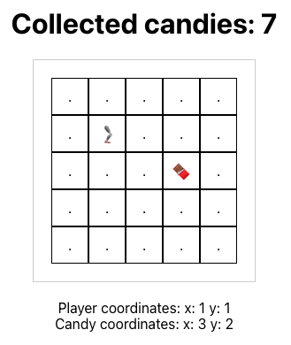

# Robot Leg App

A simple game made in React collecting Candy by a robotic leg.
Use the Arrow Keys to move the player around.

Set the size to whichever size you like by changing the Size attribute in the App.tsx.

Added tests for testing the size of the grid and rendering the app itself.

## Available Scripts

In the project directory, you can run:

### `npm start`

Runs the app in the development mode.\
Open [http://localhost:3000](http://localhost:3000) to view it in the browser.

The page will reload if you make edits.\
You will also see any lint errors in the console.

### `npm test`

Launches the test runner in the interactive watch mode.\
See the section about [running tests](https://facebook.github.io/create-react-app/docs/running-tests) for more information.

### Future additions

Future additions could use a bunch of other tests to better test all the components. The components and gameplay might be separated into their respective components with their own tests specific to player movements, candy collection, checking for points being added and so on.

